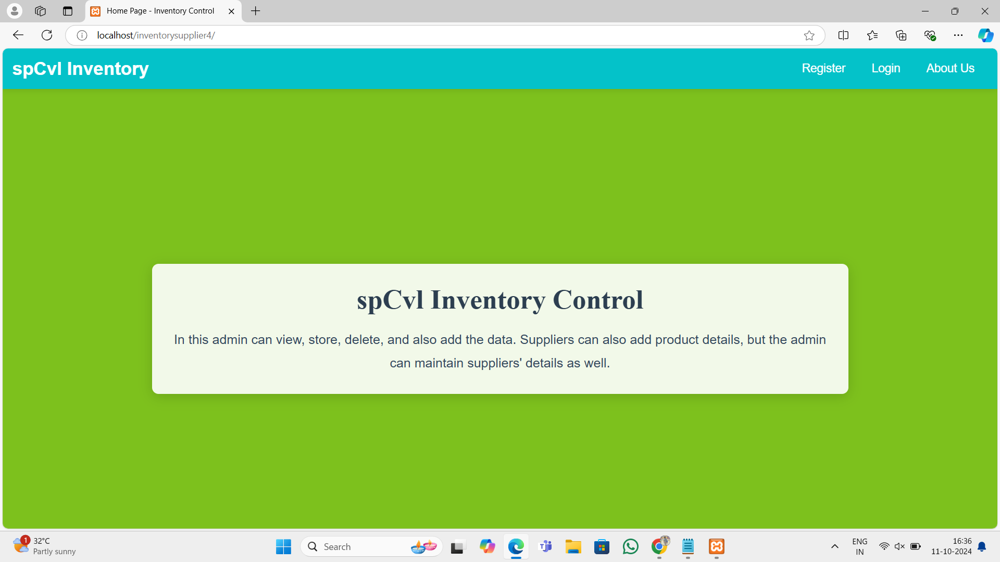
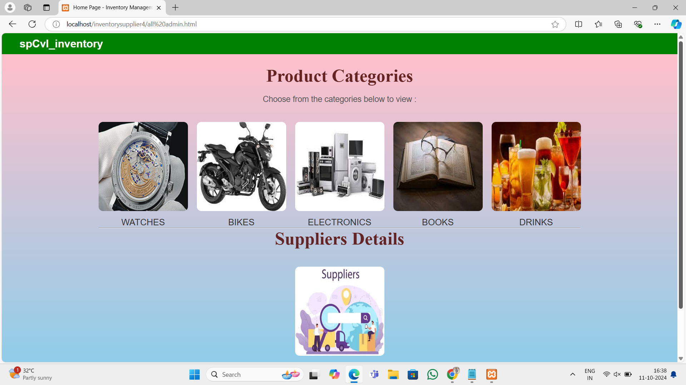
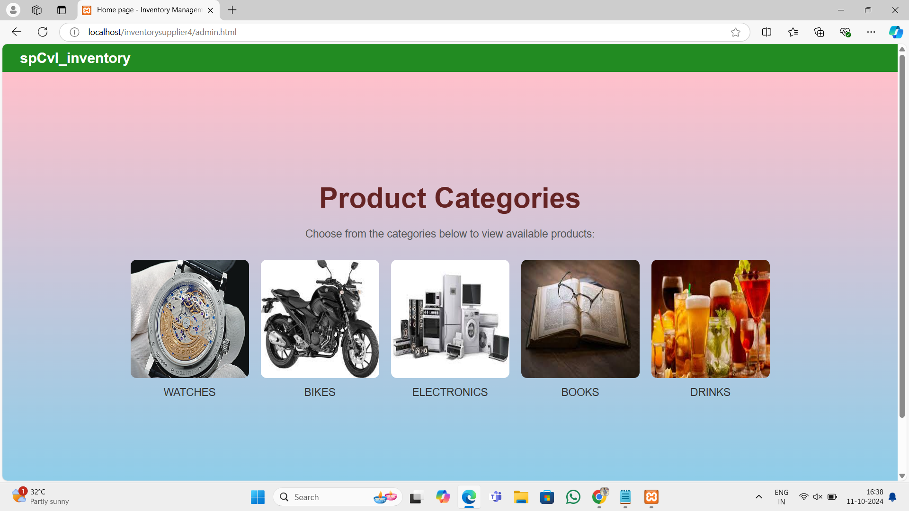

# inventory-control
A web-based system for managing product and supplier details with admin and supplier functionalities. Built with PHP, MySQL, and JavaScript. Admins can add products and manage users, while suppliers can register and log in to view product details.

## Project Overview
The **Inventory Control System** is a web-based application designed for managing product and supplier details efficiently. It allows admins to control the inventory and suppliers to manage their registrations and product entries. This project is built using **PHP**, **MySQL**, and **JavaScript**, providing a robust backend with a user-friendly frontend.

### Key Objectives:
- Streamline inventory management for better productivity.
- Simplify supplier registrations and management.
- Enhance user experience through a responsive design.

## Features
- **Admin Dashboard**: Admins can add, edit, and delete products and also the same as the  suppliers registrations, and manage inventory.
- **Supplier Registration**: Suppliers can register and log in to add, edit, and delete products.
- **Product Management**: Admin and Suppliers can view and manage their products easily.
- **Email Notifications**: Integrated PHPMailer for sending notifications and alerts.

## Technologies Used
- **PHP**: Server-side scripting language used for backend development.
- **MySQL**: Database management system for storing product and supplier information.
- **JavaScript**: Client-side scripting language for dynamic content.
- **HTML/CSS**: Standard markup and styling languages for web development.
- **PHPMailer**: A popular library used to send emails from PHP applications.
-  **Server**: XAMPP server is used in this project.

## Project output
## Some ScreenShots for this Project:
### Home page
 

### Register page
  

### Login page
 

### Admin page

### Supplier page
  

### Product page

